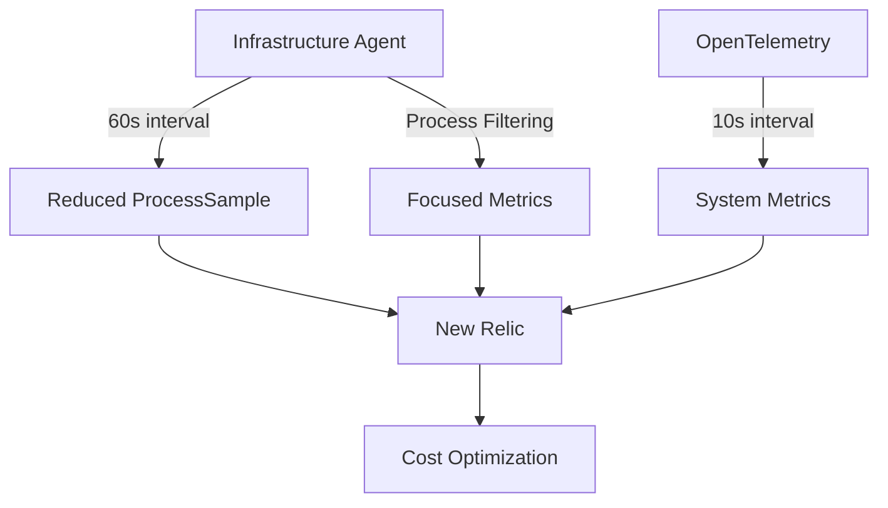

# New Relic ProcessSample Optimization Lab

[](LICENSE)

A containerized lab environment for optimizing New Relic ProcessSample events cost without sacrificing observability. Reduce ingest costs by ~70% while maintaining essential visibility.

## Table of Contents

- [The Challenge](#the-challenge)
- [Core Optimization Strategies](#core-optimization-strategies)
- [Quick Start](#quick-start)
- [Command Interface](#command-interface)
- [Configuration Options](#configuration-options)
  - [Filter Types](#filter-types)
  - [Sample Rates](#sample-rates)
  - [OpenTelemetry Configuration](#opentelemetry-configuration)
- [Testing Scenarios](#testing-scenarios)
- [Optimization Results](#optimization-results)
- [Best Practices](#best-practices)
- [Architecture](#architecture)
- [Configuration Details](#configuration-details)
- [Experimental Framework](#experimental-framework)
- [Prerequisites](#prerequisites)
- [Contributing](#contributing)
- [License](#license)

## The Challenge

ProcessSample events contribute significantly to data ingest costs due to:

- **High frequency**: 20-second default interval creates 3 events per minute per process
- **High cardinality**: One event per process, with many processes per host
- **Large event size**: Detailed metadata in each event, especially with command line collection

## Core Optimization Strategies

- **Sample Rate Adjustment**: Configure intervals from 20s (default) to 60s (~67% reduction)
- **Process Filtering**: Multiple strategies to exclude non-essential processes (~5-10% additional reduction)
- **OpenTelemetry Integration**: Maintain high-frequency system visibility with minimal data volume

## Quick Start

```bash
# Clone repository
git clone https://github.com/deepaucksharma/infra-lab.git
cd infra-lab

# Create a virtual environment (recommended)
python -m venv venv
source venv/bin/activate  # On Windows, use `venv\Scripts\activate`

# Install the package
pip install .

# Configure credentials
cp .env.example .env
# Edit .env with your NR license key, API key, and account ID

# Run the CLI
process-lab wizard  # Start the configuration wizard
process-lab generate  # Generate configuration
process-lab recommend  # Get optimization recommendations
```

### Installation Options

1. **Development Installation**:
   ```bash
   # Install in editable mode with development dependencies
   pip install -e .[dev]
   ```

2. **Docker Installation**:
   ```bash
   # Build the Docker image
   docker build -t process-lab .
   
   # Run the CLI in a container
   docker run -it process-lab wizard
   ```

## Command Interface

The lab uses a unified Python-based command interface that works across all platforms. Use the `process-lab` command followed by the desired action. For example:

```bash
process-lab wizard  # Start the configuration wizard
process-lab generate  # Generate configuration
process-lab recommend  # Get optimization recommendations
```

## Configuration Options

All options can be provided as command-line arguments:

```bash
# Change filter type
process-lab wizard --filter-type aggressive

# Change sample rate
process-lab wizard --sample-rate 120

# Enable Docker metrics
process-lab wizard --docker-stats

# Combine multiple options
process-lab wizard --filter-type targeted --sample-rate 60 --docker-stats
```

### Filter Types

| Filter | Description | Reduction |
|--------|-------------|-----------|
| none | No filtering (baseline) | 0% |
| standard | Basic system process filtering | ~5% |
| aggressive | Maximum filtering | ~10% |
| targeted | Whitelist approach | Variable |

The filter definitions are centralized in `templates/filter-definitions.yml` for easy management and customization.

#### Standard Filtering

Standard filtering excludes common system processes like:
- `systemd`, `kworker`, `kthreadd`
- `sshd`, `cron`, `chronyd`
- Other background system processes

#### Aggressive Filtering

Aggressive filtering extends the standard filters to include:
- Additional system processes
- Background services
- Shell processes
- Package management processes

#### Targeted Filtering

Targeted filtering uses a whitelist approach:
- Blocks all processes by default
- Only allows specific high-value processes (e.g., Apache, MySQL, Redis)

### Sample Rates

Set the `--sample-rate` parameter to the desired interval in seconds:

```bash
python scripts/unified/process_lab.py up --sample-rate 120  # 83% reduction from 20s default
python scripts/unified/process_lab.py up --sample-rate 60   # 67% reduction (recommended)
python scripts/unified/process_lab.py up --sample-rate 30   # 33% reduction
```

The sample rate directly controls how often ProcessSample events are generated:

| Sample Rate | Events Per Minute | Reduction |
|-------------|-------------------|-----------|
| 20s (default) | 3 | 0% (baseline) |
| 30s | 2 | 33% |
| 60s | 1 | 67% |
| 90s | 0.67 | 77% |
| 120s | 0.5 | 83% |

### OpenTelemetry Configuration

Control the OTel collection interval:

```bash
python scripts/unified/process_lab.py up --otel-interval 5s   # Higher frequency
python scripts/unified/process_lab.py up --otel-interval 10s  # Default
python scripts/unified/process_lab.py up --otel-interval 30s  # Lower overhead
```

OpenTelemetry provides supplementary system metrics to maintain visibility while reducing ProcessSample costs:

- **Host Metrics**: CPU, memory, disk, and network utilization
- **Process Metrics**: Aggregated process statistics
- **Docker Metrics**: Optional container metrics (enable with `--docker-stats`)

## Testing Scenarios

The lab includes several pre-defined testing scenarios:

```bash
# Run baseline test (original settings)
python scripts/unified/process_lab.py baseline

# Run optimized lab configuration
python scripts/unified/process_lab.py lab-opt

# Test multiple sample rates sequentially
python scripts/unified/process_lab.py rate-sweep

# Test all filter types sequentially
python scripts/unified/process_lab.py filter-matrix
```

### Scenario Categories

#### Baseline & Core-Opt

| Scenario ID | Description | Expected KPI |
|-------------|-------------|--------------|
| **bare-agent** | Baseline with no OTel service | Anchor cost |
| **lab-baseline** | Default lab setup | Shows OTel overhead |
| **lab-opt** | Optimized default setup | ≈ 70% ↓ GB/Day |

#### Sample-Rate Sweep

| Scenario ID | Description | Expected Impact |
|-------------|-------------|----------------|
| **rate-20** | 20s sample rate | Baseline cost |
| **rate-30** | 30s sample rate | ≈ 33% ↓ GB/Day |
| **rate-60** | 60s sample rate | ≈ 66% ↓ GB/Day |
| **rate-90** | 90s sample rate | ≈ 77% ↓ GB/Day |
| **rate-120** | 120s sample rate | ≈ 83% ↓ GB/Day |

#### Filtering Matrix

| Scenario ID | Description | Expected Impact |
|-------------|-------------|----------------|
| **filter-none** | No filtering | Maximum cost, full visibility |
| **filter-standard** | Standard filters | Moderate cost reduction |
| **filter-aggressive** | Extended filter list | Significant cost reduction |
| **filter-targeted** | Inclusion filtering | Maximum cost reduction, limited visibility |

## Optimization Results

| Configuration | Sample Rate | Filtering | Reduction | Visibility Impact |
|---------------|-------------|-----------|-----------|-------------------|
| Default | 20s | None | 0% (baseline) | None |
| Basic | 60s | None | ~67% | Minimal |
| Standard | 60s | Standard | ~70% | Minimal |
| Aggressive | 60s | Aggressive | ~75% | Low |
| Maximum | 120s | Aggressive | ~85% | Moderate |

The cost vs. visibility relationship can be expressed as:

```
Cost ∝ f(rate, event size, process count)
Visibility ∝ g(rate, granularity)
```

Optimizing involves finding the sweet spot where cost reduction doesn't significantly degrade observability.

## Best Practices

- **Start with standard filtering and 60s sample rate**
  - This provides ~70% cost reduction with minimal visibility impact
  - Monitor for 5-10 minutes, then use validation to check results

- **If more reduction is needed, try aggressive filtering**
  - Can provide an additional 5% reduction
  - Test thoroughly to ensure critical processes remain visible

- **For maximum reduction, use 120s sample rate with aggressive filtering**
  - Provides up to 85% reduction
  - Consider enabling OTel with a faster interval (5s) to maintain system visibility

- **Command Line Collection**
  - Disable command line collection for maximum savings
  - If needed, consider using `strip_command_line: true` to reduce event size

- **Load Considerations**
  - Under high system load, ProcessSample collection can impact performance
  - Consider using a higher sample rate in high-load environments

## Architecture

The lab consists of three main components:

1. **Infrastructure Agent**: Collects ProcessSample events with optimized configuration
2. **OpenTelemetry Collector**: Provides system metrics via hostmetrics receiver
3. **Synthetic Load Generator**: Creates realistic process patterns for testing



### ProcessSample vs. OpenTelemetry Comparison

| Aspect | ProcessSample Events | OpenTelemetry Hostmetrics |
|--------|----------------------|---------------------------|
| **Default Collection Frequency** | 20 seconds | 10 seconds |
| **Optimized Collection Frequency** | 60 seconds | 10 seconds |
| **Cardinality** | One event per process | One metric series per host |
| **Data Volume** | High (especially with many processes) | Low to moderate |
| **Granularity** | Process-level | System-level |
| **CPU Metrics** | Process CPU % | System CPU utilization, by state |
| **Memory Metrics** | Process resident memory | System memory usage, free, cached |
| **Process Details** | Command line, PID, user, etc. | No process-specific data |
| **Cost Impact** | Major contributor to data ingest | Minimal data ingest impact |

### Data Complementarity

When used together with optimized settings:

1. **ProcessSample (60s)**: Provides process-level detail at a reduced frequency
2. **Hostmetrics (10s)**: Provides high-frequency system-level metrics
3. **Combined**: Complete visibility with optimized cost

#### When to Rely on ProcessSample
- Troubleshooting specific process issues
- Identifying resource-intensive processes
- Monitoring critical application processes

#### When to Rely on Hostmetrics
- System-wide performance monitoring
- High-frequency trend analysis
- General health monitoring

## Configuration Details

All configurations are generated at runtime based on your settings:

- `config/newrelic-infra.yml` - Infrastructure agent configuration
- `config/otel-config.yaml` - OpenTelemetry collector configuration 
- `config/filter-definitions.yml` - Process filtering patterns

The configurations are fully customizable through filter definitions and environment variables.

## Experimental Framework

The lab includes a comprehensive experimental framework for evaluating different optimization strategies. Key metrics tracked include:

| Name | Formula | Description |
|------|---------|-------------|
| **PS_GB_DAY** | `bytecountestimate()/1e9` over 24 h | ProcessSample daily ingest volume |
| **METRIC_GB_DAY** | `bytecountestimate()/1e9` over 24 h | Metric API daily ingest volume |
| **VIS_DELAY_S** | Time from spike creation to visibility | Visibility delay |
| **AGENT_CPU% / MEM_MB** | System resource usage | Agent overhead |

Results from experiments are stored in the `results/` directory and can be visualized using:

```bash
python scripts/unified/process_lab.py visualize
```

## Prerequisites

- Docker Engine and Docker Compose v2+
- Python 3.6+
- New Relic account with license key, API key, and account ID

## Contributing

Contributions are welcome! Please review the [CONTRIBUTING.md](docs/CONTRIBUTING.md) file for guidelines.

## License

[MIT License](LICENSE)
