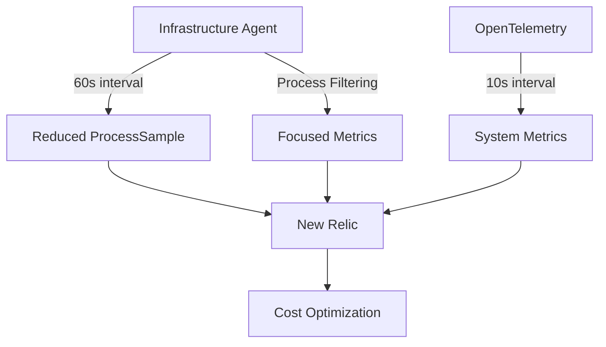

# ProcessSample Optimization Concepts

## The Challenge

ProcessSample events contribute significantly to data ingest costs due to:

- **High frequency**: 20-second default interval creates 3 events per minute per process
- **High cardinality**: One event per process, with many processes per host
- **Large event size**: Detailed metadata in each event, especially with command line collection

## Optimization Strategies

### 1. Sample Rate Adjustment

Increasing the collection interval from 20s to 60s:

```yaml
metrics_process_sample_rate: 60
```

**Result**: ~67% reduction in ProcessSample volume (1 event per minute vs 3)

### 2. Process Filtering

Excluding non-essential system processes:

```yaml
exclude_matching_metrics:
  process.systemd.*: true
  process.kworker.*: true
  # Additional process patterns
```

**Result**: ~5-10% additional reduction (varies by environment)

### 3. OpenTelemetry Supplementation

Adding higher-frequency system metrics to maintain visibility:

```yaml
receivers:
  hostmetrics:
    collection_interval: 10s
```

**Result**: Preserved system visibility with minimal data volume increase

## Optimization Architecture



## Recommended Configurations

| Use Case | Sample Rate | Filter Type | OTel Interval |
|----------|-------------|-------------|---------------|
| Maximum visibility | 30s | Standard | 5s |
| Balanced (recommended) | 60s | Standard | 10s |
| Maximum savings | 120s | Aggressive | 20s |

The lab environment allows testing all these configurations to find the optimal balance for your specific needs.