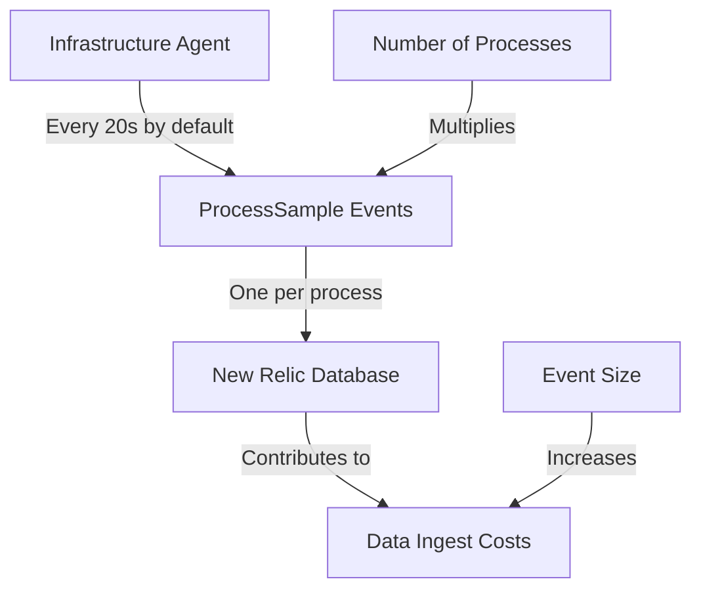
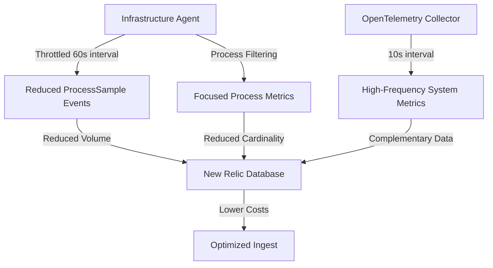

# Understanding ProcessSample Optimization

This page explains the core concepts behind ProcessSample optimization, including the cost challenges, optimization strategies, and expected outcomes.

## The Cost Challenge

ProcessSample events are generated by the New Relic Infrastructure agent to monitor process-level metrics. While valuable for observability, they can contribute significantly to data ingest costs due to three key factors:

1. **High frequency**: By default, events are generated every 20 seconds
2. **High cardinality**: One event per process means systems with many processes generate large volumes
3. **Large event size**: Each event includes detailed process information



## Cost Formula

The monthly ProcessSample ingest volume can be calculated as:

$$
Volume_{GB} = N_{processes} \times \frac{86400}{interval_{seconds}} \times days \times size_{bytes} \times 10^{-9}
$$

Where:
- $N_{processes}$ is the average number of processes
- $interval_{seconds}$ is the sample collection interval
- $days$ is the number of days in the month
- $size_{bytes}$ is the average size of each ProcessSample event

For example, a system with 100 processes using the default 20-second interval would generate:

$$
100 \times \frac{86400}{20} \times 30 \times 2000 \times 10^{-9} = 25.92 \text{ GB/month}
$$

## Optimization Strategies

The lab implements three core optimization strategies:

### Sample Rate Throttling

By increasing the interval from 20s to 60s, we achieve approximately 67% reduction in event volume:

```yaml
# config/newrelic-infra.yml
metrics_process_sample_rate: 60
```

This provides the largest optimization benefit with minimal observability impact.

### Process Filtering

By excluding non-essential processes, we can achieve an additional 5-10% reduction:

```yaml
# config/newrelic-infra.yml
exclude_matching_metrics:
  process.*.*: true
```

This focuses monitoring on critical processes and reduces "noise" from system processes.

### OpenTelemetry Metrics

By complementing ProcessSample data with OpenTelemetry hostmetrics, we maintain high-frequency visibility into system resources:

```yaml
# config/otel-config.yaml
receivers:
  hostmetrics:
    collection_interval: 10s
```

This provides system-level metrics while reducing process-level data costs.

## Optimization Flow Diagram



## Expected Outcomes

When properly implemented, you can expect:

| Configuration | Sample Rate | Filtering | Expected Volume Reduction |
|---------------|-------------|-----------|---------------------------|
| Standard | 60s | Yes | ~70-75% |
| Minimal-Mounts | 60s | Yes | ~70-75% |
| With Container Metrics | 60s | Yes | ~65-70% |

## Balancing Cost and Observability

The key to successful optimization is finding the right balance between cost reduction and maintaining observability:

1. **Temporal Resolution**: 60s interval provides sufficient temporal resolution for most use cases
2. **Process Visibility**: Critical processes remain monitored while filtering noise
3. **System Metrics**: OpenTelemetry provides higher-frequency system-level visibility

This balanced approach ensures you maintain effective monitoring capabilities while significantly reducing data ingest costs.