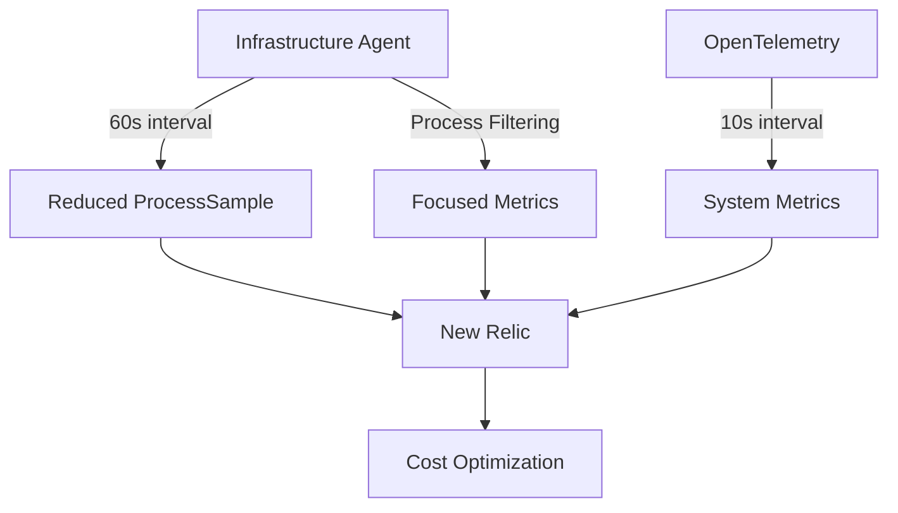

# ProcessSample Optimization Concepts

## The Problem

ProcessSample events contribute significantly to data ingest costs due to:

- **High frequency**: 20-second default interval
- **High cardinality**: One event per process
- **Large event size**: Detailed metadata in each event

## Optimization Strategies

### 1. Sample Rate Throttling (67% reduction)

Increasing the interval from 20s to 60s:

```yaml
# config/newrelic-infra.yml
metrics_process_sample_rate: 60
```

### 2. Process Filtering (5-10% additional reduction)

Excluding non-essential processes:

```yaml
# config/newrelic-infra.yml
exclude_matching_metrics:
  process.*.*: true
```

### 3. OpenTelemetry Metrics (Preserves visibility)

Complementing with higher-frequency system metrics:

```yaml
# config/otel-config.yaml
receivers:
  hostmetrics:
    collection_interval: 10s
```

## Optimization Flow



## Expected Results

| Configuration | Rate | Filtering | Expected Reduction |
|---------------|------|-----------|-------------------|
| Standard | 60s | Yes | ~70-75% |
| With Container Metrics | 60s | Yes | ~65-70% |