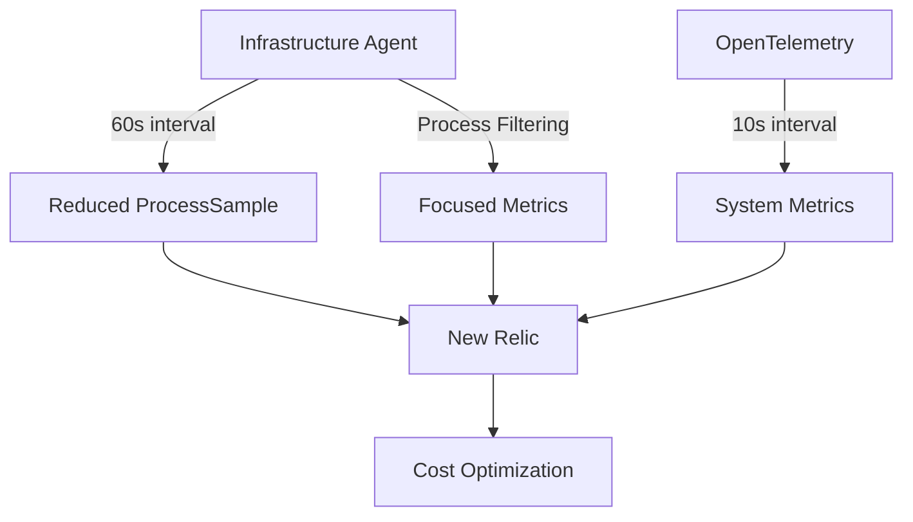

# ProcessSample Optimization Concepts

## The Challenge

ProcessSample events contribute significantly to data ingest costs due to:

- **High frequency**: 20-second default interval
- **High cardinality**: One event per process
- **Large event size**: Detailed metadata in each event

## Optimization Strategies

### 1. Sample Rate Adjustment

Increasing the collection interval from 20s to 60s:

```yaml
# config/newrelic-infra.yml
metrics_process_sample_rate: 60
```

**Result**: ~67% reduction in ProcessSample volume

### 2. Process Filtering

Excluding non-essential system processes:

```yaml
# config/newrelic-infra.yml
exclude_matching_metrics:
  process.systemd.*: true
  process.kworker.*: true
  # Additional process patterns
```

**Result**: ~5-10% additional reduction (on top of sample rate adjustment)

### 3. OpenTelemetry Supplementation

Adding higher-frequency system metrics to maintain visibility:

```yaml
# config/otel-config.yaml
receivers:
  hostmetrics:
    collection_interval: 10s
```

**Result**: Preserved system visibility with minimal data volume increase

## Optimization Architecture



## Configuration Matrix

| Sample Rate | Filter Type | OTel Interval | Data Reduction | Visibility Impact |
|-------------|-------------|---------------|----------------|-------------------|
| 20s | None | None | 0% (baseline) | None |
| 60s | None | None | ~67% | Minor |
| 60s | Standard | 10s | ~70% | Minimal |
| 60s | Aggressive | 10s | ~75% | Low |
| 120s | Aggressive | 5s | ~85% | Moderate |

The lab environment allows testing all these configurations to find the optimal balance for your specific needs.