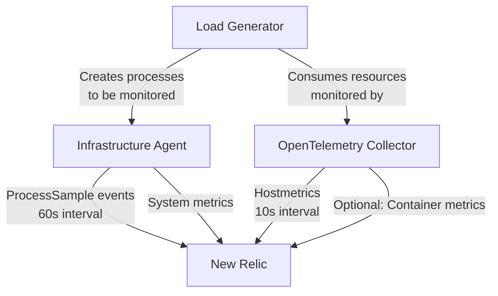

# Technical Architecture

## System Components

The ProcessSample Optimization Lab consists of three main containerized components:

### 1. Infrastructure Agent (infra)

- **Image**: newrelic/infrastructure:latest
- **Purpose**: Collects ProcessSample events and system metrics
- **Key Configurations**:
  - 60s sample rate (vs. default 20s)
  - Process filtering rules
  - Minimal host filesystem access

### 2. OpenTelemetry Collector (otel)

- **Image**: otel/opentelemetry-collector-contrib:latest
- **Purpose**: Collects system metrics via hostmetrics receiver
- **Key Configurations**:
  - 10s collection interval for high-frequency metrics
  - Configured receivers (CPU, memory, disk, network, etc.)
  - Filter processors to control metric volume
  - OTLP exporter to New Relic

### 3. Synthetic Load Generator (load)

- **Image**: Custom-built stress-ng container
- **Purpose**: Creates realistic CPU, memory, and process activity
- **Key Configurations**:
  - Configurable CPU load
  - Configurable memory usage
  - Process creation/termination cycles

## Data Flow Architecture



## Configuration Reference

### Infrastructure Agent Configuration

The key optimization settings in `config/newrelic-infra.yml`:

```yaml
enable_process_metrics: true
metrics_process_sample_rate: 60
collect_process_commandline: false
exclude_matching_metrics:
  process.name: ["systemd", "cron", "containerd", "dockerd", "sshd", "bash", "sh"]
  process.executable: ["/usr/bin/containerd", "/usr/sbin/cron", "/usr/bin/docker"]
```

### OpenTelemetry Configuration

The OpenTelemetry Collector is configured in `config/otel-config.yaml`:

```yaml
receivers:
  hostmetrics:
    collection_interval: 10s
    scrapers:
      cpu:
      memory:
      disk:
      filesystem:
      network:
      load:
  docker_stats:  # Optional, enabled in docker-stats profile
    endpoint: "unix:///var/run/docker.sock"
    collection_interval: 10s

processors:
  memory_limiter:
    check_interval: 1s
    limit_mib: 400
  filter/core-metrics:
    metrics:
      include:
        match_type: regexp
        metric_names: ["^system\\.(cpu|memory|disk|filesystem|network|load)\\..*"]
  batch:
    send_batch_size: 1000
    timeout: 5s

exporters:
  otlp:
    endpoint: "otlp.nr-data.net:4317"
    headers:
      api-key: "${NEW_RELIC_LICENSE_KEY}"
    retry_on_failure:
      enabled: true
      initial_interval: 5s
      max_interval: 30s
      max_elapsed_time: 5m

service:
  extensions: [health_check, storage]
  pipelines:
    metrics:
      receivers: [hostmetrics]
      processors: [memory_limiter, filter/core-metrics, batch]
      exporters: [otlp]
```

## Utility Scripts

### Validation Script

The `scripts/validate_ingest.sh` script queries the New Relic API to measure actual ProcessSample ingest volume:

```bash
./scripts/validate_ingest.sh
```

Sample output:
```
RESULTS:
--------------------------
ProcessSample Events: 1245
Estimated GB/day: 0.15
Estimated GB/month: 4.5
Reduction vs baseline: 73%
--------------------------
```

### CI Smoke Test

The `scripts/ci_smoke.sh` script performs basic validation of the lab environment:

1. Starts the containers with test configuration
2. Verifies health checks are passing
3. Validates configuration files
4. Confirms logs show expected activity
5. Cleans up the test environment

## Environment Variables

Key environment variables used by the lab:

| Variable | Purpose | Required |
|----------|---------|----------|
| NEW_RELIC_LICENSE_KEY | Authentication for data ingest | Yes |
| NEW_RELIC_API_KEY | For validation script API calls | For validation only |
| NR_ACCOUNT_ID | Account identifier for API calls | For validation only |
| STRESS_CPU | CPU load level for test generator | No (default: 2) |
| STRESS_MEM | Memory usage for test generator | No (default: 128M) |
| SECURE_MODE | Toggle seccomp security profile | No (default: true) |

## Future Architecture Components

The strategic roadmap envisions adding these components:

1. **Adaptive Rule Engine**: Dynamic configuration of filtering rules
2. **Service Ontology Store**: Mapping of processes to services and teams
3. **ML Pipeline**: For anomaly detection and prediction
4. **Insight Generator**: For automated analysis and recommendations
5. **Action Engine**: For policy-based remediation