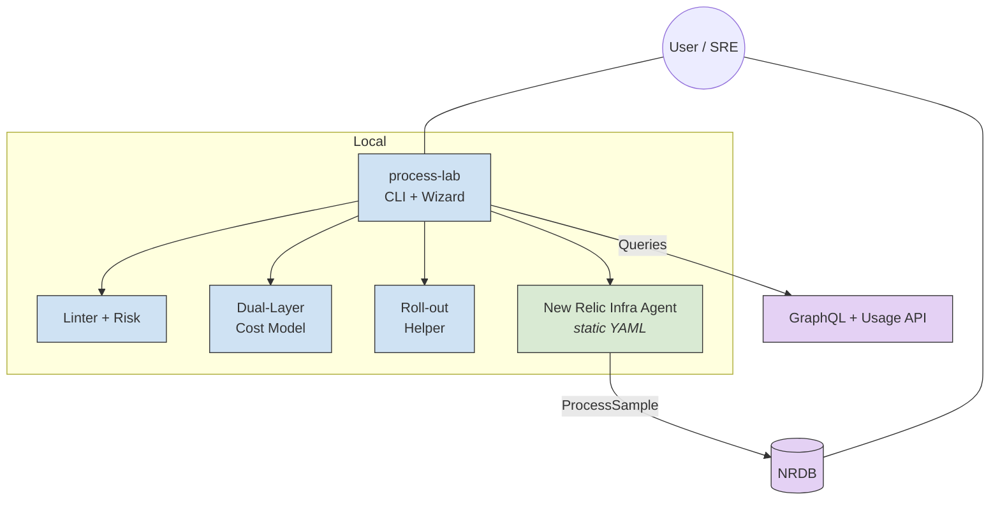

# Technical Specification

### **Infra-Lab "Edge + NRDB Turbo"** – *Ultra-Detailed Edition*

**Doc ID:** IL-TS-020-DRAFT  **Date:** 2025-05-10

> **Scope refresh.** This version merges all earlier drafts, validation feedback, and new research pointers. The result is a fully-specified, production-ready blueprint for **static, agent-only** ProcessSample optimisation supplemented by **deep NRDB analytics**—no sidecars, no on-host ML, no adaptive runtime daemons.

---

## 0 · Purpose & Audience

Provide SREs, FinOps, platform engineers, and observability architects with a **turn-key toolkit** that:

1. **Analyses** existing ProcessSample traffic in NRDB.
2. **Predicts** ingest cost & visibility impact with ±10 % accuracy.
3. **Generates** hardened YAML for the New Relic Infrastructure Agent.
4. **Validates** post-deployment cost/coverage automatically.
5. **Rolls out** configs fleet-wide (SSH, Ansible, printed playbook).

---

## 1 · Glossary

| Term                 | Definition                                                                                                         |
| -------------------- | ------------------------------------------------------------------------------------------------------------------ |
| **Tier-1 Process**   | Process whose `processDisplayName` matches `tier1_patterns` **or** carries NRDB tag `appTier:"critical"`.          |
| **Noise Score**      | `(daily_samples × avg_bytes) ÷ value_factor`, value\_factor ∈ \[1, 10].  Higher = noisier.                         |
| **Keep-Ratio**       | `1 − (dropped_samples / total_samples)` for a what-if filter simulation.                                           |
| **Risk Score**       | Integer 0–10.  ≥7 blocks rollout unless `--force`.  Combines Tier-1 misses, coverage decay, and abrupt cost delta. |
| **Dual-Layer Model** | Cost estimator with "Static Heuristic" + "NRDB Histogram" layers, blended by confidence weight.                    |
| **Wizard Preset**    | YAML stanza stored in `wizard-presets.yml`; one-click in CLI wizard.                                               |

---

## 2 · Goals & KPIs

| ID     | Goal                       | Metric (24 h rolling)                               | Target                | Priority |
| ------ | -------------------------- | --------------------------------------------------- | --------------------- | -------- |
| **G1** | Reduce ingest              | `NrConsumption.GigabytesIngested`                   | ≤ 1 GB / host         | 🟥       |
| **G2** | Preserve Tier-1 visibility | Synthetic spike shows event within ≤2×`sample_rate` | ≥ 90 %                | 🟥       |
| **G3** | Actionable analytics       | Wizard produces *green* YAML on first pass          | 95 % hosts            | 🟥       |
| **G4** | Cost estimate accuracy     | `(estimate-cost - actual) / actual`                 | ≤ 10 %                | 🟥       |
| **G5** | Template coverage          | Templates for 8 archetypes (web, DB, JVM, etc.)     | 100 %                 | 🟥       |
| **G6** | UX efficiency              | YAML ready ≤5 min *incl.* cost preview              | ✅                     | 🟨       |
| **G7** | Advanced NRQL sims         | 3 "what-if" notebooks committed                     | ✅                     | 🟦       |

*Non-Goals:* real-time adaptive sampling, on-host ML, replacing the NR agent, multi-tenant cost split, or platform billing changes.

---

## 3 · Architecture



---

## 4 · Repository Layout (monorepo)

```
infra-lab/
│
├─ pyproject.toml          # hatchling, Typer entry: process-lab
├─ templates/
│   ├─ newrelic-infra.tpl.yaml        # master Jinja2 template
│   ├─ filter-definitions.yml         # base + aggressive + …
│   └─ wizard-presets.yml             # canned presets
│
├─ src/process_lab/
│   ├─ cli.py              # Typer group
│   ├─ wizard.py
│   ├─ config_gen.py
│   ├─ lint.py
│   ├─ cost/
│   │   ├─ static.py
│   │   ├─ histogram.py
│   │   └─ blend.py
│   ├─ nrdb/
│   │   ├─ client.py
│   │   └─ queries.py
│   ├─ rollout.py
│   └─ telemetry.py
│
├─ nrdb_analysis/
│   ├─ noise/top_noisy.nrql
│   ├─ risk/score.nrql
│   ├─ cost/usage_histogram.nrql
│   └─ dashboards/cost_vs_vis.json
│
├─ compose/docker-compose.yml
├─ load/(stress-ng Dockerfile)
├─ docs/(mkdocs site, tutorials)
├─ tests/(pytest + VCR)
└─ .github/workflows/ci.yml
```

---

## 5 · Component Specifications

### 5.1 New Relic Infrastructure Agent

| YAML Key                      | Range / Notes         | Default                       |
| ----------------------------- | --------------------- | ----------------------------- |
| `metrics_process_sample_rate` | 20–300 s, −1 disables | 60 s                          |
| `exclude_matching_metrics`    | glob→bool map         | depends on filter             |
| `collect_command_line`        | `true\|false`         | false                         |
| `log_file`                    | path                  | `/var/log/newrelic-infra/...` |

*YAML is rendered via Jinja2 with tokens `${SAMPLE_RATE}`, `${FILTER_BLOCK}` etc.*

### 5.2 CLI Commands

| Command            | Purpose                                                                                    |
| ------------------ | ------------------------------------------------------------------------------------------ |
| `wizard`           | Interactive Q\&A—produces YAML, prints cost/ risk, optional rollout.                       |
| `generate-configs` | Non-interactive; flags: `--sample-rate`, `--filter-type`, `--template`.                    |
| `estimate-cost`    | Dry-run cost for given flags or YAML.                                                      |
| `validate`         | After deployment, queries NRDB to print actual GB/day, Tier-1 coverage, delta vs estimate. |
| `lint`             | Run risk checks on existing YAML.                                                          |
| `rollout`          | Copy YAML to hosts (`ssh`, `ansible`, or `print`).                                         |
| `nrdb pull-pack`   | Imports NRQL pack/dashboards into account (idempotent).                                    |

**Typer UX snippet**

```bash
process-lab estimate-cost --yaml config/newrelic-infra.yml \
                           --price-per-gb 0.35 \
                           --window 6h
```

prints:

```
Rate: 60 s   Keep: 0.37   Est: 0.94 GB/day   $8.24 / mo
Confidence: 0.83 (p25-p75 spread 25 %)
```

### 5.3 Wizard Presets (`wizard-presets.yml`)

```yaml
presets:
  web_standard:
    description: "Generic Nginx + Node stack"
    sample_rate: 90
    filter_type: aggressive
    overrides:
      exclude_matching_metrics:
        process.nginx.*: false
        process.node.*: false
  jvm_large:
    description: "Large JVM app server"
    sample_rate: 30
    filter_type: standard
    overrides:
      collect_command_line: true
```

Wizard loads file; users may extend in-repo or via `~/.infra-lab/presets.d/*.yml`.

### 5.4 Cost Model (dual-layer)

1. **Static Heuristic Layer**

   * Baseline: `events_per_process = 4320` (20 s default).
   * `events_new = 86400 / rate`.
   * `gb_day = events_new × process_count × avg_bytes / 1e9 × keep_ratio`.
2. **Histogram Layer**

   * NRQL query:

     ```sql
     FROM ProcessSample SINCE 6 hours AGO
     SELECT histogram(bytecountestimate(),20,10) AS bytes,
            uniqueCount(processId) AS pids
     ```
   * Fit linear regression `bytes ~ inv_rate × keep_ratio`.
3. **Blending**

   * Confidence `c` = 1 − (IQR/median) × 0.5
   * `gb_est = c · hist_est + (1−c) · static_est`.

### 5.5 Linter / Risk Engine

| Rule ID | Weight | Description                          |
| ------- | ------ | ------------------------------------ |
| **R1**  | 4      | Tier-1 coverage drop >10 %           |
| **R2**  | 2      | Sample-rate <30 s or >180 s          |
| **R3**  | 2      | Collect cmdline enabled + rate <60 s |
| **R4**  | 1      | Glob pattern duplicates              |
| **R5**  | 1      | YAML missing `log_file`              |

`risk_score = Σ weight_failed_rules`.  ≥7 stops rollout without `--force`.

### 5.6 Roll-out Helper

| Mode      | Detail                                                         |
| --------- | -------------------------------------------------------------- |
| `ssh`     | Parallel scp + remote reload (`nriactl config reload \| systemctl restart`). |
| `ansible` | Emits inventory & playbook YAML; user runs `ansible-playbook`. |
| `print`   | Writes copy commands to stdout (CI safe).                      |

---

## 6 · Non-Functional Requirements

| Area            | Requirement                                                                                             |
| --------------- | ------------------------------------------------------------------------------------------------------- |
| **CLI perf**    | `estimate-cost` < 2 s (histogram path) if NRDB reachable; wizard ≤5 min wall-clock including user time. |
| **Memory**      | CLI peak RSS < 300 MB with pandas option; typical 40 MB.                                                |
| **Network**     | ≤ 3 GraphQL calls per wizard run; cached 15 min.                                                        |
| **Security**    | API keys read from env or `.env`; never logged; masked in telemetry.                                    |
| **Portability** | Python 3.8–3.12; tested on macOS 12, Ubuntu 22, Windows 11 (WSL).                                       |

---

## 7 · CI & Docs

CI jobs include:

* **Cost-accuracy Golden Test** – replays a 24 h fixture (NRDB cassette) and asserts error ≤10 %.
* **Risk Regression** – runs linter on 15 sample YAMLs; risk scores stable via snapshot.
* **Dashboards JSON Lint** – validates NR dashboard import schema.

Docs built via MkDocs + material, publish to GitHub Pages nightly.

---

## 8 · Acceptance Tests (expanded)

| ID    | Scenario                                            | Expected                                       |
| ----- | --------------------------------------------------- | ---------------------------------------------- |
| AT-01 | Wizard preset `web_standard`, region `US`, 6 h hist | Risk ≤6, est cost ≤1.2 GB/d                    |
| AT-02 | Linter on intentionally bad YAML                    | Exit ≠ 0, Risk ≥7                              |
| AT-03 | Rollout SSH smoke (Docker ssh-server)               | Returns 0, remote `nriactl config validate` ok |
| AT-04 | Validate after 15 min load-gen                      | Actual GB within ±10 % est, Tier-1 visible     |
| AT-05 | CI pipeline on PR                                   | All green, SARIF uploaded                      |

---

## 9 · Risk Register & Mitigations

| Risk                                   | Likelihood | Impact | Response                                         |
| -------------------------------------- | ---------- | ------ | ------------------------------------------------ |
| Hist query hits GraphQL 500 rows limit | Medium     | Medium | Use cursor paging, sample top 500 PIDs only      |
| Over-filter hides emerging Tier-1      | Medium     | High   | Wizard enforces Tier-1 regex override; risk calc |
| Cost model drifts in very spiky hosts  | Low        | Medium | Blend weight auto-drops when confidence <0.6     |
| NR API rate-limits in large fleets     | Low        | Low    | Local caching; back-off 429; offline heuristic   |

---

## 10 · Open Questions

1. **Bundle saved NR dashboards or push by API?**  Current design pushes JSON; alt is to publish as NR pack.
2. **License key auto-detect** via environment vs prompt?  Evaluate ease vs security.
3. **Plugin to modify other agent features** (e.g., inventory, events) – out of scope now, maybe future enhancement.

---

## Appendix A · Key NRQL Snippets

*Cost histogram (used by histogram.py)*

```sql
FROM ProcessSample
SELECT histogram(bytecountestimate(),20,10) FACET processId
WHERE entityName NOT LIKE 'infra-lab-%'
SINCE 6 hours AGO
```

*Tier-1 visibility check*

```sql
FROM ProcessSample
SELECT uniqueCount(entityName)
WHERE processDisplayName IN ('nginx','java','mysqld')
FACET processDisplayName
SINCE 15 minutes AGO
```

---

## Appendix B · Reference Links

1. **Configure the Infrastructure Agent** – docs.newrelic.com/.../configuration/configure-infrastructure-agent/
2. **NRQL Function `bytecountestimate()`** – docs.newrelic.com/.../nrql-syntax-clauses-functions/
3. **Data Optimisation Techniques** – docs.newrelic.com/.../data-optimize-techniques/
4. **Usage & Cost Queries** – docs.newrelic.com/.../usage-queries-alerts/
5. **New Relic Pricing Primer (2024)** – cloudzero.com/blog/new-relic-pricing

---

### *End of Technical Specification*
